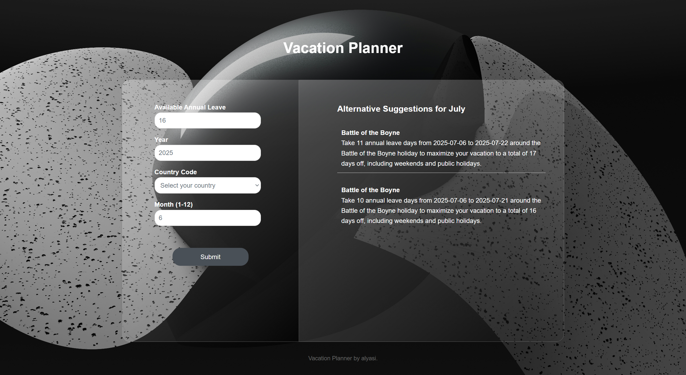

# Vacation Planner

A web application that helps users maximise their annual leave by suggesting optimal leave days around public holidays and weekends.

## Features

- **Smart Suggestions**: Enter any month, and the app will suggest optimal leave days. If no public holidays exist in the selected month, it will recommend an alternative month.
- **Multiple Options**: If more than one public holiday exists in a month, it will provide two different leave suggestions.
- **Efficiency Metrics**: Calculate how effectively you're maximising your holiday time.
- **Annual Leave Calculation**: Determine how many annual leave days you need to take to achieve the suggested vacation plan.

## How to use 

- **Enter the Information**
  Provide the month and year for which you want vacation suggestions.

- **Submit Your Request**
  After filling out the form, click the **Submit** button.

- **View Suggestions**
  Get two optimised vacation suggestions for the selected month, showing how to maximise your time off.

- **Alternative Recommendations**
  If the selected month has no public holidays, the app will suggest an alternative month. 

  
  

## How to Run

1. **Set Up Azure Key and Endpoint**
   Configure your Azure key and endpoint in the environment variables or configuration file.
2. **Obtain Nager.Date API Key**
   Sign up and acquire a key from the [Nager.Date API](https://date.nager.at/Api).
3. **Run Flask**
   Activate your virtual environment and start the Flask server.

## APIs Used

- [Azure API](https://azure.microsoft.com/en-gb/pricing/purchase-options/azure-account/search?icid=free-search)
- [Public Holiday API by Nager.Date](https://date.nager.at/Api)

